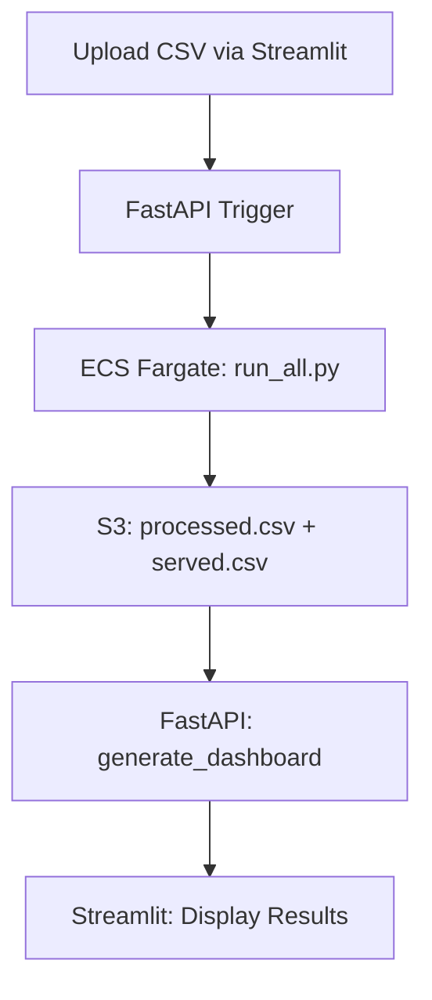

# 🧠 AWS Sentiment Analysis Pipeline

This repository implements an end-to-end sentiment analysis pipeline using AWS services with fully automated CI/CD using GitHub Actions. It handles data ingestion, preprocessing, model training, evaluation, and deployment with a web-based user interface.

---

## 📁 Project Structure

```
sentiment-app/
├── backend/                # FastAPI backend APIs
│   ├── main.py             # Entry point for FastAPI
│   ├── routes/             # API endpoints
│   └── utils/              # Utility functions
├── frontend/               # Streamlit user interface
│   └── streamlit_app.py    # Frontend application
├── sentiment-pipeline/     # PySpark + BERT inference logic
│   ├── run_clean.py        # Preprocessing
│   ├── run_infer.py        # Inference
│   └── run_all.py          # Combined pipeline for ECS
├── Dockerfile              # Containerization for Spark + Transformers
├── requirements.txt        # Unified Python dependencies
└── .github/workflows/      # GitHub Actions CI/CD workflows
```

---

## 🔄 Data Pipeline (AWS Glue)

| Step              | Script                  | Input                             | Output                                  |
| ----------------- | ----------------------- | --------------------------------- | --------------------------------------- |
| Preprocessing     | `data_preprocessing.py` | `Bronze/train.parquet`            | `Bronze/pre_processed.parquet`          |
| Schema Validation | `schema_validation.py`  | `Bronze/pre_processed.parquet`    | `Bronze/schema_validated.parquet`       |
| Anomaly Detection | `anomaly_detection.py`  | `Bronze/schema_validated.parquet` | `Bronze/anomaly_flagged.parquet`        |
| Sampling          | `sampling.py`           | `Bronze/anomaly_flagged.parquet`  | `Silver/sampled.csv`, `Silver/test.csv` |

**Orchestrated via**: AWS Glue Workflows

---

## 🤗 Model Training & Evaluation (SageMaker)

* **Model**: DistilBERT
* **Training**: AWS SageMaker (`Silver/sampled.csv`)
* **Evaluation**: Local using Hugging Face `Trainer.evaluate()` on `Silver/test.csv`
* **Metrics**:

  * Accuracy: 93.14%
  * Precision: 94.34%
  * Recall: 91.78%
  * F1 Score: 93.05%
* **Artifacts**: `s3://mlops-sentiment-analysis-data/models/model.tar.gz`

---

## 🚀 Deployment

### 🖥️ Backend (FastAPI)

* `/login` - AWS Cognito
* `/trigger_pipeline` - Launch ECS job
* `/generate_dashboard` - Generate dashboard

### 🌐 Frontend (Streamlit)

* Upload CSV → Trigger pipeline → View dashboard
* Polls ECS job status in real-time

### 🐳 ECS Fargate Execution

* `run_all.py`: Executes preprocessing and inference using Spark and Transformers
* Output saved to S3: `processed/{user}/processed.csv`, `output/{user}/served.csv`

---

## 🔁 CI/CD (GitHub Actions)

### ✅ Continuous Integration (CI)

* Run on every push
* Installs dependencies
* Executes unit tests with `pytest`

### 🚀 Continuous Deployment (CD)

* Builds Docker image
* Pushes to AWS ECR
* Deploys updated image to ECS task
* Triggers SageMaker training and logs output to MLflow

---

## 🔐 Environment Setup

* `.env` file includes credentials for Cognito, ECS, and S3
* Transferred securely via SCP to EC2 instance

---

## 📊 Visual Overview

### 🔸 Data + Model + Deployment Pipeline



---

## 📁 S3 Bucket Structure

```
s3://mlops-sentiment-analysis-data/
├── raw/
├── Bronze/
├── Silver/
├── test/
├── output/{user}/served.csv
├── processed/{user}/processed.csv
├── metadata/
```

---

## 📡 Monitoring & Logs

```bash
# Backend logs
$ tail -f fastapi.log

# Frontend logs
$ tail -f streamlit.log
```

---

## 🙌 Credits

Built using: AWS Glue, SageMaker, ECS Fargate, EC2, FastAPI, Streamlit, HuggingFace, PySpark, MLflow

---

## Teammates
Aniruthan S A & Janani Karthikeyan

> ✨ Fully CI/CD-enabled, cloud-optimized sentiment analysis app ready for production!
